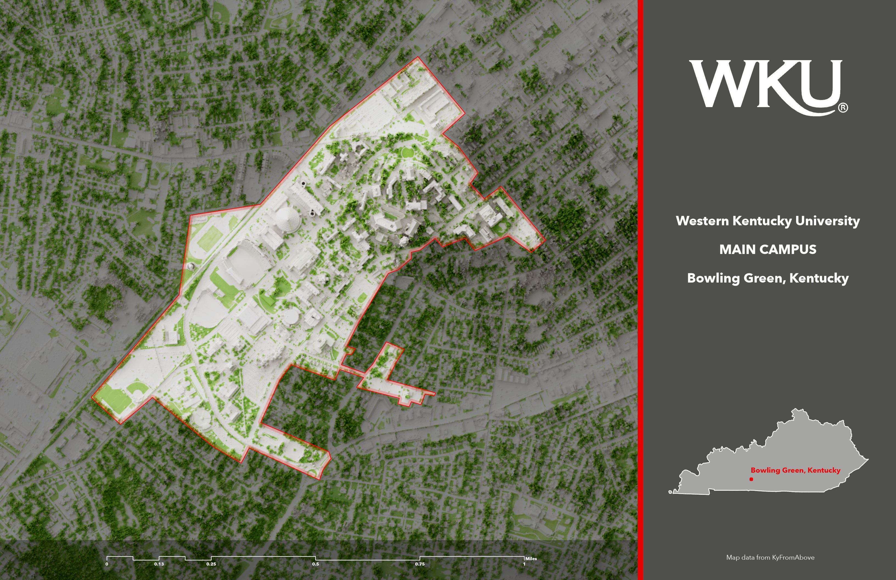
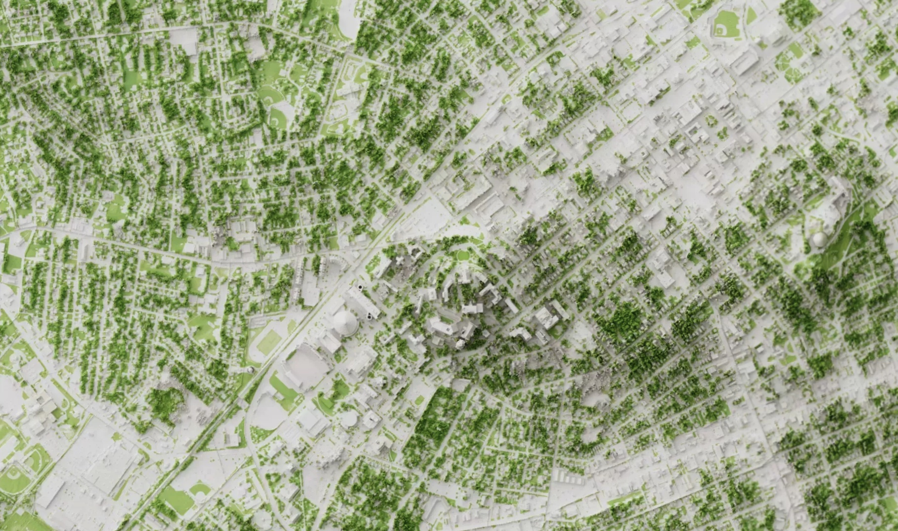

# WKU in Bowling Green, Kentucky
Custom shaded relief map for Bowling Green

Link to [GitHub Pages site](https://tastyfreeze.github.io/bowling-green)

[Link to geospatial PDF](Campus-map.pdf)

Interactive Mapbox shaded relief of above-ground features and vegetation. [Enlarge map](map.html)

Western Kentucky University was established in 1906 near the city center of Bowling Green, Kentucky and west of the Barren River. The school has an enrollment ofg over 17,000 students and its main campus area is approximately 200 acres.

The goal of this project is show above-ground features and vegetation for WKU's campus. The project uses lidar point clouds to model features and 2020 NAIP aerial photography to extract vegetation with an NDVI analysis.

Page and visualizations created by B for GEO 409, Department of Geography, University of Kentucky. Spring 2022.

Visualizations created from lidar data provided by [KyFromAbove](https://kyfromabove.ky.gov) in ArcGIS Pro and Blender. Additional sources of information [from wikipedia.org](https://en.wikipedia.org/wiki/Western_Kentucky_University), April 18, 2022.
